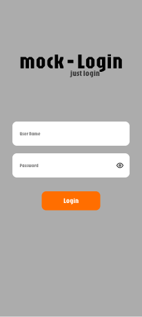

# clean_login

  

A simple login app built with Flutter using Clean Architecture principles.

Perfect for demonstrating separation of concerns, testability, and scalable project structure.

  

## Screenshots

| Login Page |

|------------|

|  |

  

## Architecture

This project uses full Clean Architecture:

  

- `presentation`: UI + Cubit (state management)

- `domain`: Entities + UseCases

- `data`: Models + Remote Data Source

- `core`: Error handling and network

  

## Technologies

- Dio for HTTP

- Flutter Bloc/Cubit for state

- get_it for dependency injection

- Mock API: https://fakestoreapi.com

  

## Test Credentials

```json

{

"username": "mor_2314",
"password": "83r5^_"

}